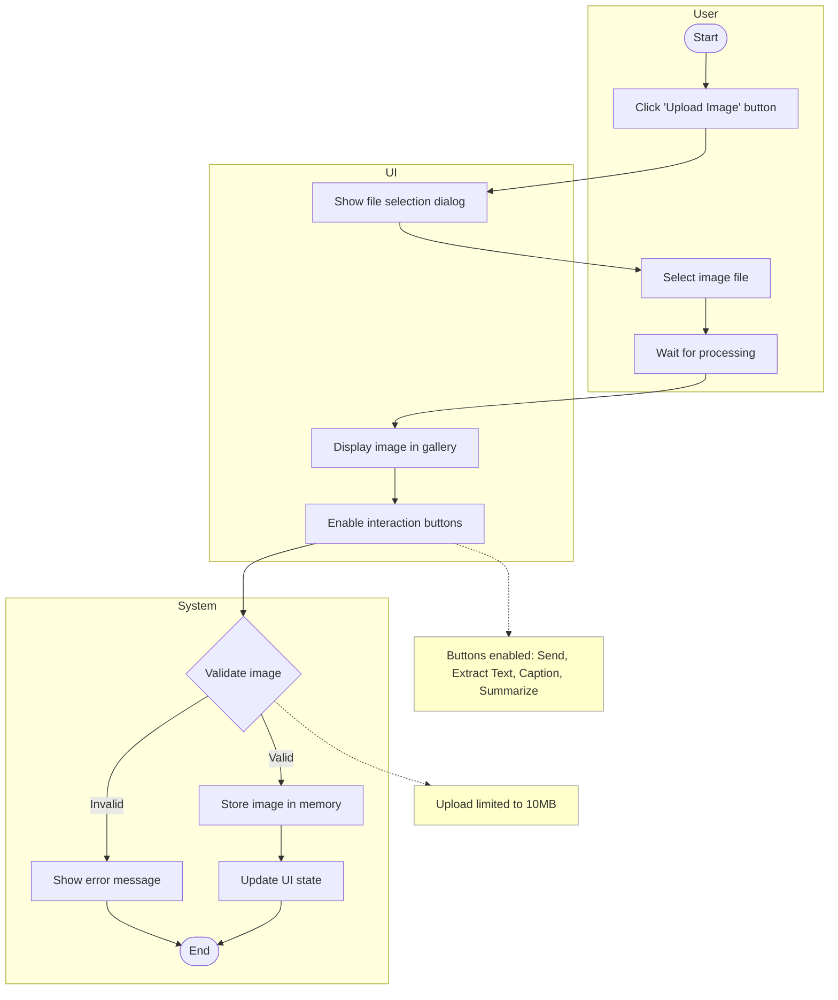
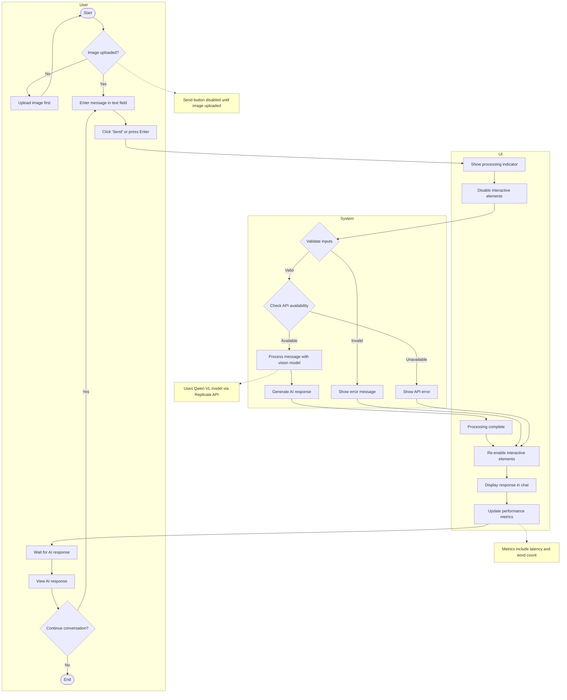
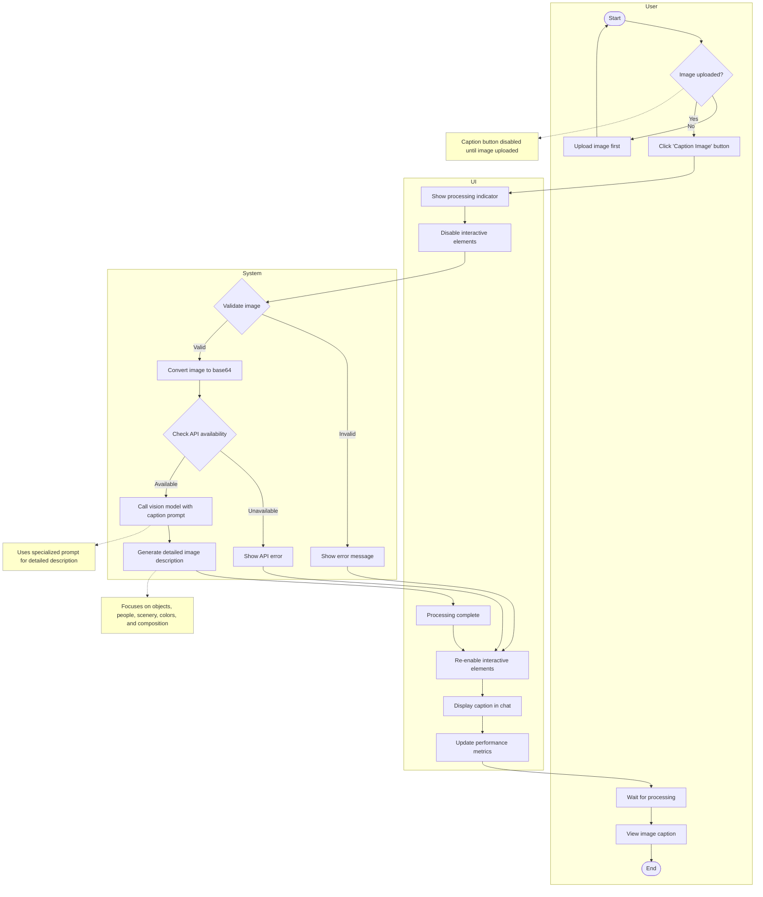
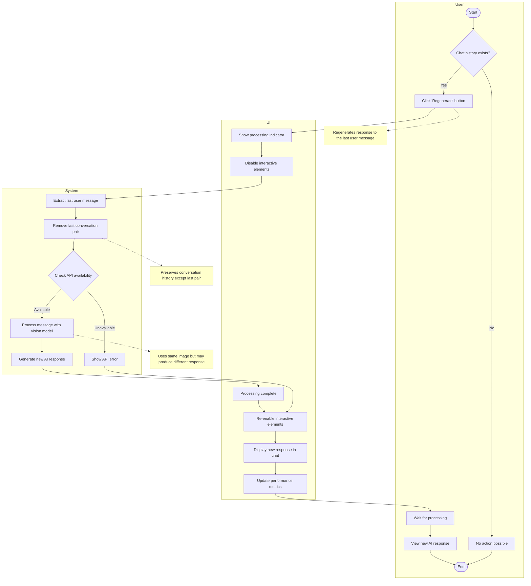

# HearSee Application - UML Activity Diagrams

This document contains UML activity diagrams for the key workflows in the HearSee application, a multimodal chat application with vision and voice capabilities.

## Table of Contents

1. [Image Upload Workflow](#image-upload-workflow)
2. [Chat Interaction Workflow](#chat-interaction-workflow)
3. [Text Extraction Workflow](#text-extraction-workflow)
4. [Image Captioning Workflow](#image-captioning-workflow)
5. [Image Summarization Workflow](#image-summarization-workflow)
6. [Text-to-Speech Conversion Workflow](#text-to-speech-conversion-workflow)

## Image Upload Workflow

## Chat Interaction Workflow

## Text Extraction Workflow

## Image Captioning Workflow

## Image Summarization Workflow

## Text-to-Speech Conversion Workflow

## Regenerate Response Workflow

## Clear History Workflow

## Exception Handling Workflow

## System Startup Workflow

These activity diagrams provide a comprehensive visualization of all key workflows in the HearSee application, including both happy paths and exception handling. The diagrams use consistent notation throughout and clearly represent the system boundaries and actor responsibilities through swimlanes.