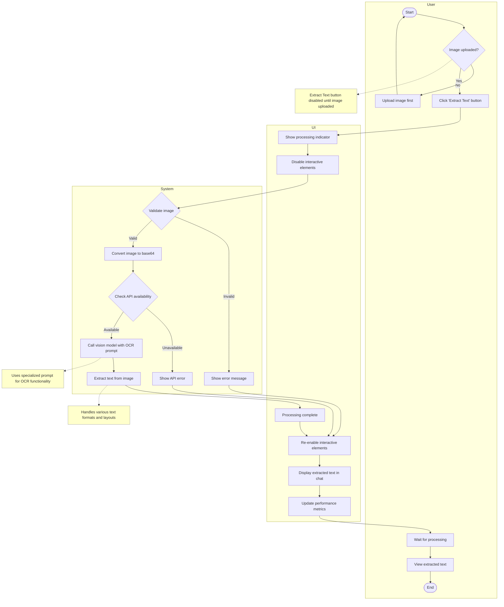
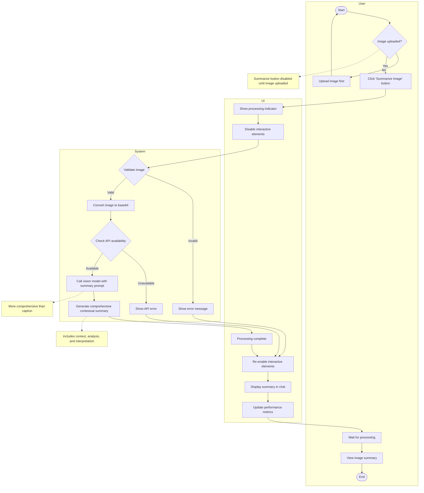
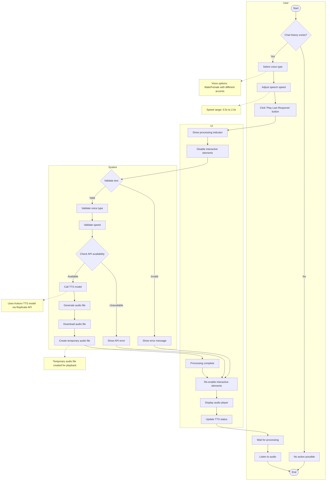
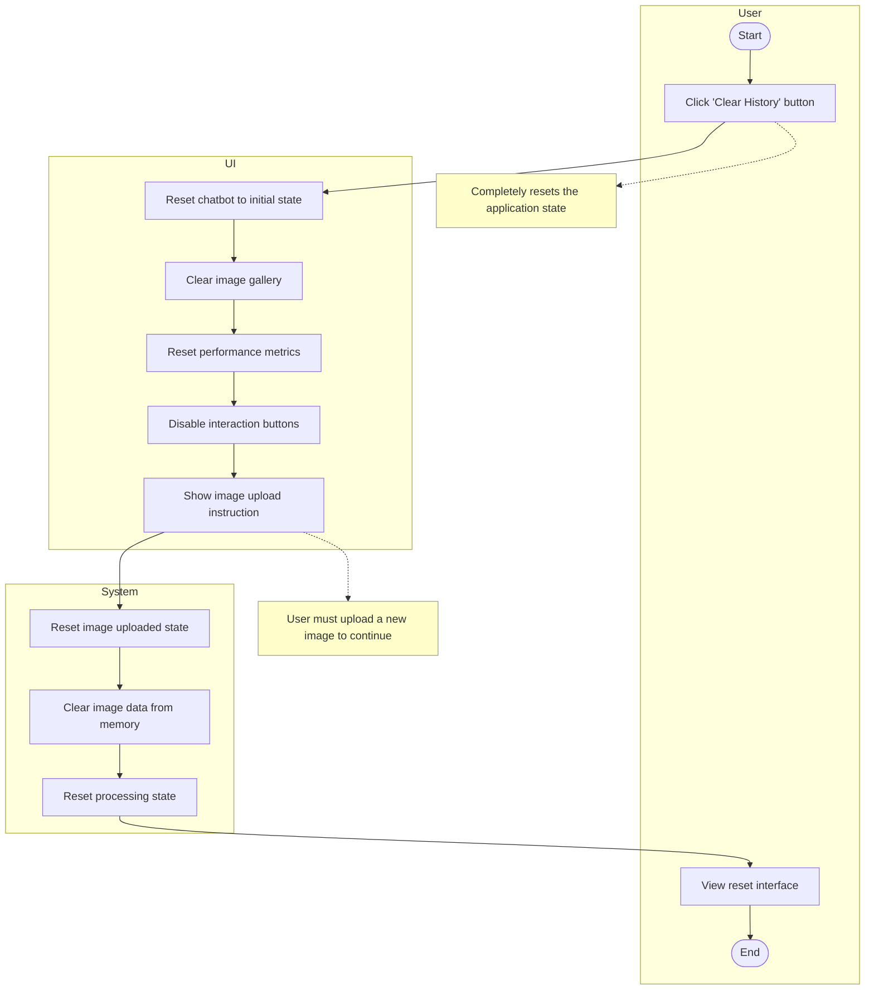
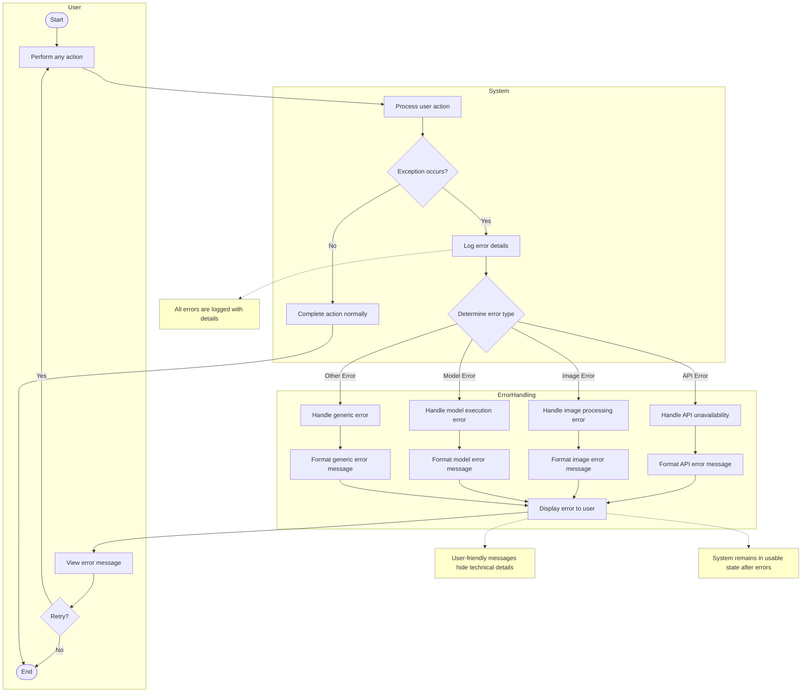
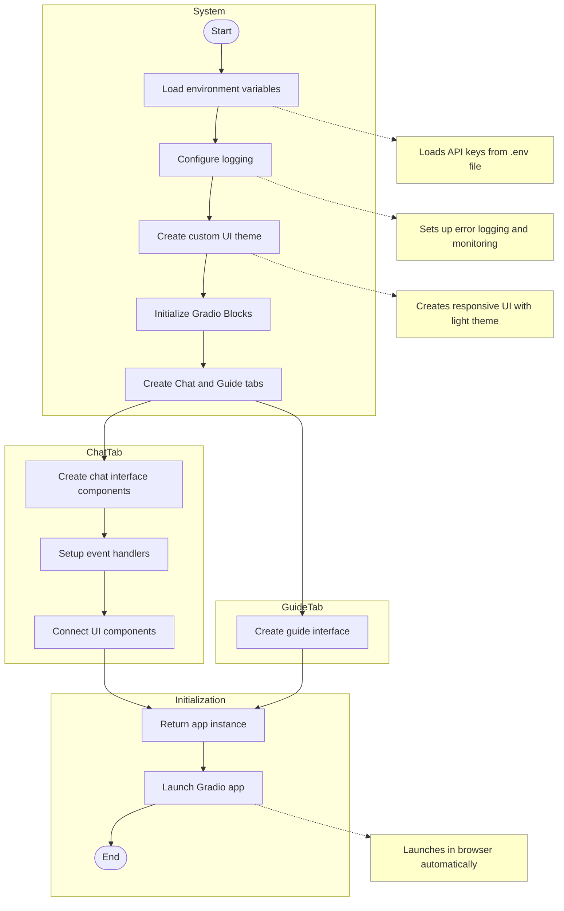

# HearSee Application - UML Activity Diagrams

This document contains UML activity diagrams for the key workflows in the HearSee application, a multimodal chat application with vision and voice capabilities.

## Table of Contents

1. [Image Upload Workflow](#image-upload-workflow)
2. [Chat Interaction Workflow](#chat-interaction-workflow)
3. [Text Extraction Workflow](#text-extraction-workflow)
4. [Image Captioning Workflow](#image-captioning-workflow)
5. [Image Summarization Workflow](#image-summarization-workflow)
6. [Text-to-Speech Conversion Workflow](#text-to-speech-conversion-workflow)
7. [Regenerate Response Workflow](#regenerate-response-workflow)
8. [Clear History Workflow](#clear-history-workflow)
9. [Exception Handling Workflow](#exception-handling-workflow)
10. [System Startup Workflow](#system-startup-workflow)

## Image Upload Workflow

This diagram illustrates the process of uploading an image to the HearSee application, which is the initial step required for all image-based interactions. It shows how the system validates the uploaded image, stores it in memory, and updates the UI to enable further interaction options. This workflow is critical as it establishes the foundation for all subsequent image analysis operations in the application.

## Chat Interaction Workflow

This diagram depicts the core conversational functionality of the HearSee application, showing how users can interact with the AI vision model after uploading an image. It demonstrates the complete flow from user input to AI response generation, including validation steps, API communication, and UI updates. This workflow represents the primary way users engage with the system to get information about uploaded images through natural language conversation.

## Text Extraction Workflow

This diagram outlines the specialized workflow for extracting text from images (OCR functionality) in the HearSee application. It shows how the system processes an uploaded image specifically for text recognition, sends it to the vision model with specialized OCR prompts, and returns the extracted text to the user. This workflow is particularly useful for documents, signs, or any image containing textual information that users want to convert to editable text.

## Image Captioning Workflow

This diagram illustrates the process of generating descriptive captions for uploaded images. It shows how the system uses the vision model with specialized prompting to create detailed descriptions focusing on objects, people, scenery, colors, and composition. This workflow provides users with concise, objective descriptions of image content, serving as a quick way to get factual information about what appears in an image.

## Image Summarization Workflow

This diagram presents the workflow for generating comprehensive contextual summaries of uploaded images. Unlike the captioning workflow which focuses on objective description, this process creates more in-depth analysis including context, interpretation, and significance of image elements. This workflow helps users understand not just what appears in an image, but also its broader meaning and implications, providing deeper insights than simple captioning.

## Text-to-Speech Conversion Workflow

This diagram details the process of converting AI-generated text responses into spoken audio. It shows how users can select voice types and adjust speech speed before the system processes the text through a TTS model and delivers playable audio. This workflow enhances accessibility by providing an auditory alternative to reading text responses, making the application more inclusive for users with visual impairments or those who prefer audio content.

## Regenerate Response Workflow

This diagram illustrates the process of regenerating an AI response to the last user message. It shows how the system extracts the previous user message, removes the last conversation pair, and processes the message again to generate a new response. This workflow provides users with the ability to get alternative perspectives or answers when they're not satisfied with the initial AI response, enhancing the interactive experience without requiring users to rephrase their questions.

## Clear History Workflow

This diagram outlines the process of resetting the application to its initial state. It shows how the system clears the chat history, image gallery, and performance metrics, effectively starting a fresh session. This workflow is essential for privacy and usability, allowing users to quickly remove all traces of previous interactions and start new conversations with different images without having to reload the application.

## Exception Handling Workflow

This diagram details the system's approach to handling various types of errors that may occur during operation. It illustrates how exceptions are caught, logged, categorized by type, and presented to users with appropriate messages. This workflow is crucial for maintaining system stability and providing a smooth user experience even when problems occur, ensuring that users understand what went wrong and can take appropriate action to resolve issues.

## System Startup Workflow

This diagram depicts the initialization sequence when the HearSee application is launched. It shows how the system loads environment variables, configures logging, creates the UI theme, initializes components, and sets up event handlers before launching the application. This workflow provides insight into the application's architecture and startup process, illustrating how the various components are initialized and connected to create a cohesive user experience from the moment the application starts.

These activity diagrams provide a comprehensive visualization of all key workflows in the HearSee application, including both happy paths and exception handling. The diagrams use consistent notation throughout and clearly represent the system boundaries and actor responsibilities through swimlanes.