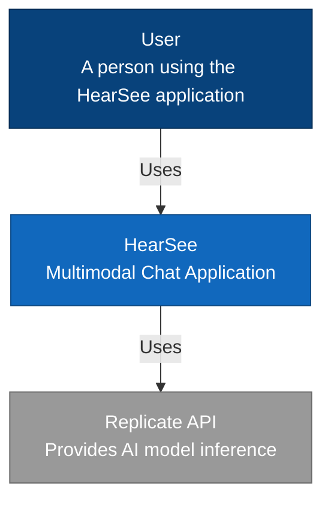
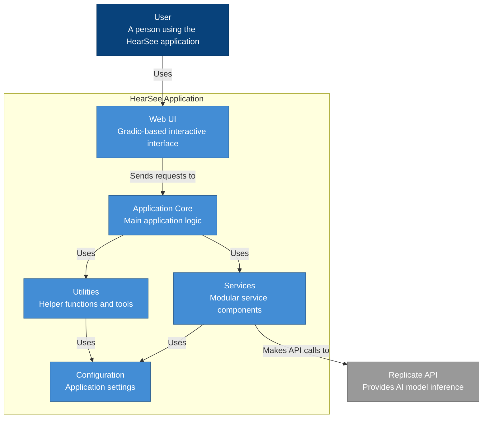
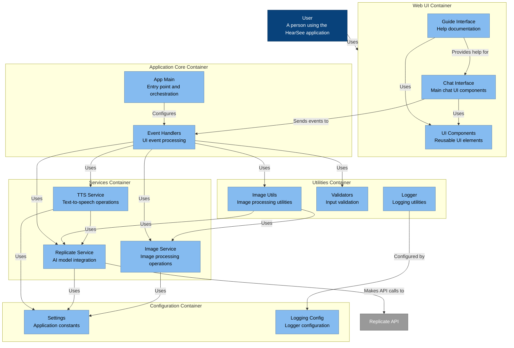

# C4 Architecture Diagrams for HearSee Application

## Introduction

This document presents a comprehensive C4 architecture visualization for the HearSee web application. The C4 model provides a hierarchical approach to describing software architecture at different levels of abstraction, making it easier to communicate and understand the system structure.

The diagrams follow the standard C4 notation:
- **Person**: End users of the system (represented as stick figures)
- **System**: A high-level software system (represented as a box)
- **Container**: An application or data store (represented as a box within the system)
- **Component**: A grouping of related functionality (represented as a box within a container)
- **Code**: Classes, interfaces, and their relationships (represented as UML-style diagrams - not included in this document)

## Level 1: System Context Diagram

The System Context diagram shows HearSee and its relationships with users and external systems.

### Description

The System Context diagram illustrates:

- **Users** interact directly with the HearSee application through a web interface
- **HearSee** is the core system providing multimodal chat capabilities with vision and voice features
- **Replicate API** is an external service that provides AI model inference for:
  - Vision-language understanding (Qwen VL model)
  - Text-to-speech conversion (Kokoro TTS model)

## Level 2: Container Diagram

The Container diagram shows the high-level technical building blocks of the HearSee system.

### Description

The Container diagram shows:

- **Web UI**: A Gradio-based web interface that provides interactive components for users
- **Application Core**: The main application logic that coordinates between UI and services
- **Services**: Modular components that handle specific functionality:
  - Image processing
  - AI model integration via Replicate
  - Text-to-speech conversion
- **Utilities**: Helper functions for image processing, logging, and validation
- **Configuration**: Centralized application settings and constants
- **Replicate API**: External service providing AI model inference capabilities

## Level 3: Component Diagram

The Component diagram breaks down the containers into their principal structural elements.

### Description

The Component diagram details:

- **Web UI Container**:
  - **Chat Interface**: Main chat UI components and layout
  - **Guide Interface**: Help documentation and user guidance
  - **UI Components**: Reusable UI elements shared across interfaces

- **Application Core Container**:
  - **App Main**: Entry point and application orchestration
  - **Event Handlers**: Processing of UI events and coordination of services

- **Services Container**:
  - **Image Service**: Image processing operations (conversion, validation)
  - **Replicate Service**: Integration with Replicate API for AI models
  - **TTS Service**: Text-to-speech operations and audio handling

- **Utilities Container**:
  - **Image Utils**: Higher-level image processing utilities
  - **Validators**: Input validation functions
  - **Logger**: Logging utilities for application monitoring

- **Configuration Container**:
  - **Settings**: Application constants and configuration values
  - **Logging Config**: Logger configuration settings

## Conclusion

These C4 architecture diagrams provide a comprehensive view of the HearSee application from different levels of abstraction:

1. **System Context**: Shows the application in relation to its users and external systems
2. **Container**: Illustrates the high-level technical building blocks
3. **Component**: Details the principal structural elements within each container
4. **Code**: Presents key classes and their relationships (not shown in this diagram file)