# HearSee Web Application - UML Class Diagram

## Overview

This UML class diagram represents the architecture of the HearSee web application, a multimodal chat application with vision and voice capabilities. The application allows users to upload images, analyze them with AI vision models, and convert text responses to speech.

The diagram is organized into logical components:
- User Interface
- Services
- Utilities
- Configuration

## Class Diagram

```mermaid
classDiagram
    %% User Interface Components
    class ChatInterface {
        <<static>>
        +create_interface() dict
    }
    
    class GuideInterface {
        <<static>>
        +create_guide() gr.Markdown
    }
    
    class UIComponents {
        <<static>>
        +create_chatbot_component() gr.Chatbot
        +create_image_instruction() gr.HTML
        +create_voice_type_dropdown() gr.Dropdown
        +create_speed_slider() gr.Slider
        +create_mllm_status() gr.Textbox
    }
    
    class UIStateManager {
        <<static>>
        +create_state_variables() dict
        +update_ui_state(image_state) tuple
        +reset_state() dict
    }
    
    %% Services
    class ImageService {
        <<static>>
        +image_to_base64(image) str
        +verify_image_size(image) tuple
        +preprocess_image(image) numpy.ndarray
        +extract_image_metadata(image) dict
    }
    
    class ReplicateService {
        <<static>>
        +verify_api_available() tuple
        +run_vision_model(prompt, image_base64, max_tokens) str
        +run_tts_model(text, voice_id, speed) str
    }
    
    class TTSService {
        <<static>>
        +validate_voice_type(voice_type) str
        +validate_speed(speed) float
        +process_audio(text, voice_type, speed) tuple
        -_create_temp_audio_file(content) str
        +cleanup_audio_file(file_path) void
    }
    
    %% Utilities
    class ImageUtils {
        <<static>>
        +extract_text(image, history) tuple
        +caption_image(image, history) tuple
        +summarize_image(image, history) tuple
    }
    
    class Validators {
        <<static>>
        +validate_message(message) tuple
        +validate_image_input(image) tuple
        +validate_history(history) list
        +get_last_bot_message(history) str
        +validate_tts_input(text, voice_type, speed) tuple
    }
    
    class Logger {
        <<static>>
        +setup_logger(name, level) logging.Logger
        +log_exception(logger, e, message) void
        +log_api_call(logger, api_name, params) void
    }
    
    %% Application
    class HearSeeApp {
        +create_app() gr.Blocks
        -process_chat_message(message, history, metrics, image) tuple
        -regenerate_last_response(history, metrics, image) tuple
        -text_to_speech_conversion(history, voice_type, speed) tuple
        -update_button_state(image) tuple
        -start_processing() tuple
        -end_processing(chatbot_val, metrics_val, image_uploaded_state) tuple
        -end_processing_tts(audio_val, status_val, image_uploaded_state) tuple
        -locked_chat_response(message, history, metrics, image) tuple
        -clear_interface_state() tuple
    }
    
    %% Configuration
    class Settings {
        <<static>>
        +QWEN_VL_MODEL str
        +KOKORO_TTS_MODEL str
        +DEFAULT_MAX_TOKENS int
        +MAX_IMAGE_SIZE int
        +INIT_HISTORY list
        +VOICE_TYPES dict
        +TTS_SPEED_RANGE tuple
        +DEFAULT_VOICE str
        +DEFAULT_SPEED float
    }
    
    class LoggingConfig {
        <<static>>
        +configure_logging() void
    }
    
    %% Relationships
    
    %% UI Component Relationships
    ChatInterface ..> UIComponents : uses
    GuideInterface ..> UIComponents : uses
    HearSeeApp *-- ChatInterface : contains
    HearSeeApp *-- GuideInterface : contains
    HearSeeApp --> UIStateManager : uses
    
    %% Service Relationships
    TTSService --> ReplicateService : uses
    ImageUtils --> ImageService : uses
    ImageUtils --> ReplicateService : uses
    
    %% Utility Relationships
    HearSeeApp --> ImageUtils : uses
    HearSeeApp --> Validators : uses
    
    %% Configuration Relationships
    HearSeeApp --> Settings : uses
    HearSeeApp --> LoggingConfig : uses
    ImageService --> Settings : uses
    ReplicateService --> Settings : uses
    TTSService --> Settings : uses
    
    %% Logger Relationships
    LoggingConfig --> Logger : configures
    ImageService --> Logger : uses
    ReplicateService --> Logger : uses
    TTSService --> Logger : uses
    ImageUtils --> Logger : uses
    Validators --> Logger : uses
    HearSeeApp --> Logger : uses
    
    %% Service Dependencies
    HearSeeApp --> ImageService : uses
    HearSeeApp --> ReplicateService : uses
    HearSeeApp --> TTSService : uses
```

## Component Details

### User Interface Component

The UI component is responsible for creating and managing the user interface elements of the application.

#### ChatInterface
- **Purpose**: Creates the main chat interface with all components and event handlers
- **Key Methods**:
  - `create_interface()`: Returns a dictionary of Gradio components for the chat interface

#### GuideInterface
- **Purpose**: Creates the help and documentation interface
- **Key Methods**:
  - `create_guide()`: Returns a Markdown component with formatted application guide

#### UIComponents
- **Purpose**: Provides reusable UI components for the application
- **Key Methods**:
  - `create_chatbot_component()`: Creates the main chatbot display
  - `create_image_instruction()`: Creates the image upload instruction
  - `create_voice_type_dropdown()`: Creates the voice type selection dropdown
  - `create_speed_slider()`: Creates the speech speed slider
  - `create_mllm_status()`: Creates the performance metrics display

#### UIStateManager
- **Purpose**: Manages the state of UI components across the application
- **Key Methods**:
  - `create_state_variables()`: Creates and initializes state variables
  - `update_ui_state(image_state)`: Updates UI component states based on application state
  - `reset_state()`: Resets all state variables to their initial values

### Services Component

The Services component provides core functionality for image processing, AI model integration, and text-to-speech conversion.

#### ImageService
- **Purpose**: Handles image processing operations
- **Key Methods**:
  - `image_to_base64(image)`: Converts image to base64 string
  - `verify_image_size(image)`: Verifies image size is within limits
  - `preprocess_image(image)`: Performs basic preprocessing on images
  - `extract_image_metadata(image)`: Extracts metadata from images

#### ReplicateService
- **Purpose**: Handles interactions with Replicate API for AI models
- **Key Methods**:
  - `verify_api_available()`: Checks if Replicate API token is available
  - `run_vision_model(prompt, image_base64, max_tokens)`: Runs the vision model
  - `run_tts_model(text, voice_id, speed)`: Runs the text-to-speech model

#### TTSService
- **Purpose**: Handles text-to-speech operations
- **Key Methods**:
  - `validate_voice_type(voice_type)`: Validates and gets voice ID
  - `validate_speed(speed)`: Validates and adjusts speech speed
  - `process_audio(text, voice_type, speed)`: Processes text to speech conversion
  - `cleanup_audio_file(file_path)`: Cleans up temporary audio files

### Utilities Component

The Utilities component provides helper functions for various operations.

#### ImageUtils
- **Purpose**: Provides utilities for image operations
- **Key Methods**:
  - `extract_text(image, history)`: Extracts text from images
  - `caption_image(image, history)`: Generates captions for images
  - `summarize_image(image, history)`: Generates summaries for images

#### Validators
- **Purpose**: Provides validation functions for inputs
- **Key Methods**:
  - `validate_message(message)`: Validates chat message input
  - `validate_image_input(image)`: Validates image input
  - `validate_history(history)`: Validates chat history format
  - `get_last_bot_message(history)`: Extracts last bot message from history
  - `validate_tts_input(text, voice_type, speed)`: Validates TTS inputs

#### Logger
- **Purpose**: Provides logging utilities
- **Key Methods**:
  - `setup_logger(name, level)`: Sets up a logger with specified name and level
  - `log_exception(logger, e, message)`: Logs exceptions with context
  - `log_api_call(logger, api_name, params)`: Logs API calls with parameters

### Application Component

The Application component is the main entry point for the HearSee application.

#### HearSeeApp
- **Purpose**: Creates and configures the HearSee application
- **Key Methods**:
  - `create_app()`: Creates and configures the Gradio interface
  - `process_chat_message(message, history, metrics, image)`: Processes chat messages
  - `regenerate_last_response(history, metrics, image)`: Regenerates the last response
  - `text_to_speech_conversion(history, voice_type, speed)`: Converts text to speech
  - Various helper methods for UI state management

### Configuration Component

The Configuration component provides settings and configuration for the application.

#### Settings
- **Purpose**: Centralizes configuration parameters
- **Key Attributes**:
  - `QWEN_VL_MODEL`: Replicate model identifier for vision-language model
  - `KOKORO_TTS_MODEL`: Replicate model identifier for text-to-speech model
  - `DEFAULT_MAX_TOKENS`: Default maximum token limit for API responses
  - `MAX_IMAGE_SIZE`: Maximum allowed image size
  - `INIT_HISTORY`: Initial conversation history
  - `VOICE_TYPES`: Mapping of voice names to IDs
  - `TTS_SPEED_RANGE`: Minimum and maximum speech speed
  - `DEFAULT_VOICE`: Default voice type
  - `DEFAULT_SPEED`: Default speech speed

#### LoggingConfig
- **Purpose**: Configures logging for the application
- **Key Methods**:
  - `configure_logging()`: Sets up logging configuration

## Relationships and Multiplicity

1. **Composition (Has-A)**:
   - HearSeeApp *-- ChatInterface: The application contains a chat interface (1:1)
   - HearSeeApp *-- GuideInterface: The application contains a guide interface (1:1)

2. **Dependency (Uses)**:
   - ChatInterface ..> UIComponents: The chat interface uses UI components (1:n)
   - GuideInterface ..> UIComponents: The guide interface uses UI components (1:n)
   - HearSeeApp --> UIStateManager: The application uses the UI state manager (1:1)
   - TTSService --> ReplicateService: The TTS service uses the Replicate service (1:1)
   - ImageUtils --> ImageService: Image utilities use the image service (1:1)
   - ImageUtils --> ReplicateService: Image utilities use the Replicate service (1:1)
   - HearSeeApp --> Services: The application uses various services (1:n)
   - HearSeeApp --> Utilities: The application uses various utilities (1:n)
   - Services --> Settings: Services use configuration settings (n:1)
   - Services --> Logger: Services use logger for operation tracking (n:1)
   - Utilities --> Logger: Utilities use logger for operation tracking (n:1)
   - LoggingConfig --> Logger: LoggingConfig configures Logger (1:1)

## Design Patterns

1. **Facade Pattern**: The HearSeeApp class provides a simplified interface to the complex subsystem of UI components, services, and utilities.

2. **Strategy Pattern**: The different image processing methods (extract_text, caption_image, summarize_image) represent different strategies for processing images.

3. **Singleton Pattern**: The configuration classes (Settings, LoggingConfig) are effectively singletons, providing global access to configuration parameters.

4. **Static Utility Pattern**: Most classes use static methods, functioning as utility classes rather than instantiable objects.

5. **Factory Method Pattern**: The create_interface() and create_guide() methods act as factory methods, creating and returning UI components.

## Notes

- The application follows a modular architecture with clear separation of concerns between UI, services, and utilities.
- Static methods are used extensively, indicating a functional rather than object-oriented approach.
- The application relies heavily on external services (Replicate API) for AI functionality.
- Error handling and validation are implemented throughout the application for robustness.
- The UI is built using Gradio, a Python library for creating web interfaces for machine learning models.