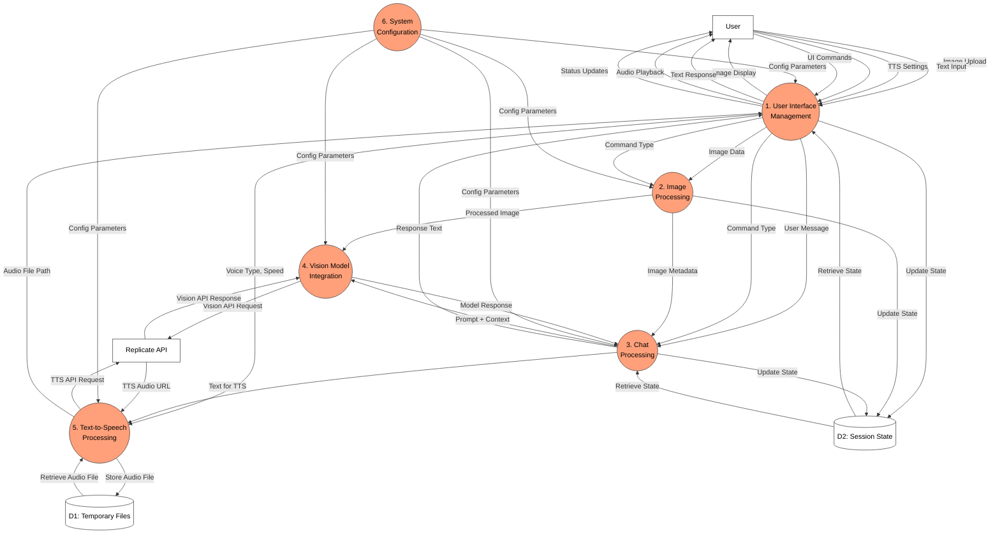

# Data Flow Diagram for HearSee Application

## Introduction

This document presents a comprehensive Data Flow Diagram (DFD) for the HearSee web application following the Structured Systems Analysis and Design Method (SSADM). The DFD illustrates how data moves through the system, showing the interactions between processes, external entities, and data stores.

## SSADM DFD Notation Legend

The diagram uses standard SSADM notation:

| Symbol | Description | Visual Representation |
|--------|-------------|------------------------|
| Process | A function or transformation that processes data | Circle |
| External Entity | An external system or person that interacts with the system | Rectangle |
| Data Store | A repository where data is stored | Open-ended rectangle or parallel lines |
| Data Flow | Movement of data between elements | Labeled arrow |

## Level 1 DFD

### Process Descriptions

The Level 1 DFD breaks down the HearSee system into six major processes:

1. **User Interface Management**
   - Handles all user interactions through the Gradio web interface
   - Displays images, text responses, and status updates
   - Manages audio playback
   - Routes commands to appropriate processes

2. **Image Processing**
   - Validates and processes uploaded images
   - Converts images to appropriate formats (base64)
   - Extracts image metadata
   - Prepares images for AI model processing

3. **Chat Processing**
   - Manages conversation context and history
   - Formats prompts for the vision model
   - Processes model responses
   - Prepares text for TTS conversion

4. **Vision Model Integration**
   - Handles communication with Replicate API for vision models
   - Sends formatted requests with images and prompts
   - Receives and processes model responses
   - Handles API errors and retries

5. **Text-to-Speech Processing**
   - Validates TTS parameters (voice type, speed)
   - Sends TTS requests to Replicate API
   - Downloads and manages audio files
   - Provides audio files for playback

6. **System Configuration**
   - Manages application settings and parameters
   - Provides configuration values to all processes
   - Handles environment variables and defaults

### Data Store Descriptions

The data stores in the system include:

- **D1: Temporary Files**
  - Purpose: Stores downloaded audio files temporarily
  - Content: WAV audio files from TTS processing
  - Persistence: Files are deleted after use

- **D2: Session State**
  - Purpose: Maintains the current application state
  - Content: Conversation history, uploaded images, UI state
  - Persistence: In-memory during the application session

### Data Flow Descriptions

The diagram illustrates several key data flows through the system:

1. **Image Processing Flow**:
   - User uploads an image → UI Management → Image Processing → Vision Model Integration → Replicate API → Vision Model Integration → Chat Processing → UI Management → User

2. **Text Input Flow**:
   - User enters text → UI Management → Chat Processing → Vision Model Integration → Replicate API → Vision Model Integration → Chat Processing → UI Management → User

3. **TTS Processing Flow**:
   - Chat Processing provides text → TTS Processing → Replicate API → TTS Processing → Temporary Files → TTS Processing → UI Management → User

4. **Configuration Flow**:
   - System Configuration → All processes → Affects all data processing

This SSADM-compliant DFD provides a comprehensive view of how data flows through the HearSee application, from user input to external API interactions and back to user output.