# HearSee Application - Sequence Diagrams

This document contains sequence diagrams for the HearSee application, showing the interactions between actors and system components for each use case defined in the use case diagram.

## Table of Contents

1. [Upload Image](#1-upload-image)
2. [Send Message](#2-send-message)
3. [Regenerate Response](#3-regenerate-response)
4. [Clear Chat History](#4-clear-chat-history)
5. [Extract Text from Image](#5-extract-text-from-image)
6. [Caption Image](#6-caption-image)
7. [Summarize Image](#7-summarize-image)
8. [Convert Text to Speech](#8-convert-text-to-speech)
9. [Select Voice Type](#9-select-voice-type)
10. [Adjust Speech Speed](#10-adjust-speech-speed)
11. [Process Image with Vision Model](#11-process-image-with-vision-model)
12. [Generate Audio with TTS Model](#12-generate-audio-with-tts-model)

## 1. Upload Image

This sequence diagram shows the interactions when a user uploads an image to the application.

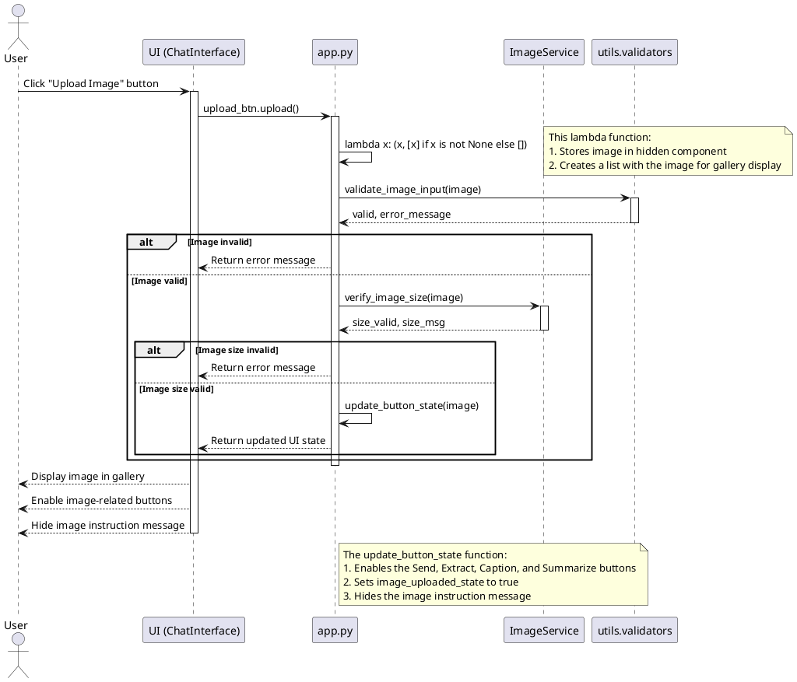

## 2. Send Message

This sequence diagram shows the interactions when a user sends a message related to an uploaded image.

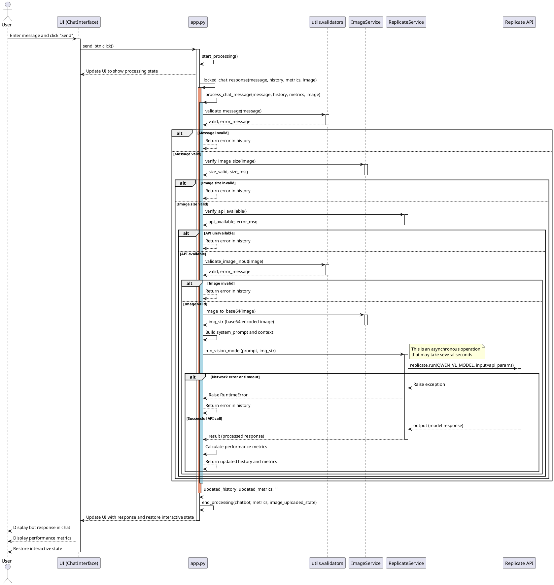

## 3. Regenerate Response

This sequence diagram shows the interactions when a user requests to regenerate the last response.

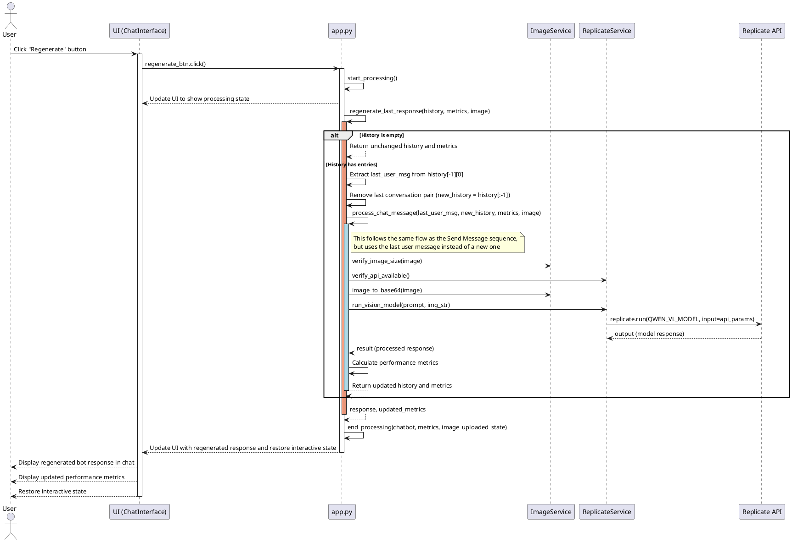

## 4. Clear Chat History

This sequence diagram shows the interactions when a user clears the chat history.

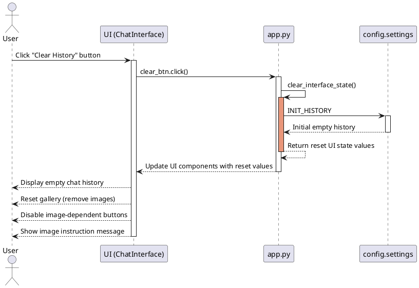

## 5. Extract Text from Image

This sequence diagram shows the interactions when a user requests to extract text from an uploaded image.

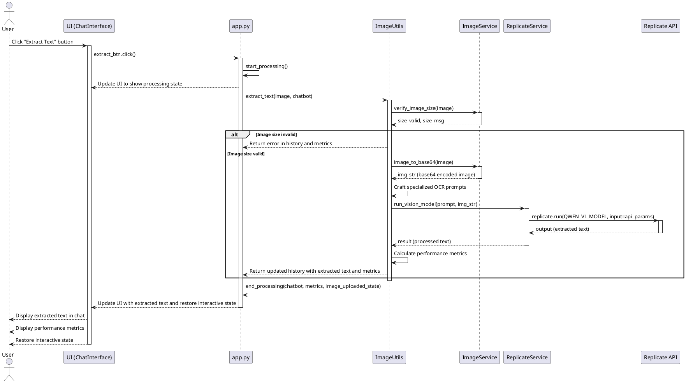

## 6. Caption Image

This sequence diagram shows the interactions when a user requests to generate a caption for an uploaded image.

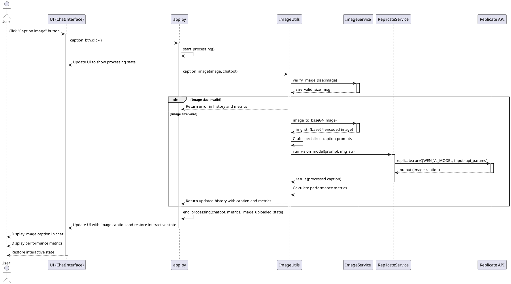

## 7. Summarize Image

This sequence diagram shows the interactions when a user requests to generate a detailed summary of an uploaded image.

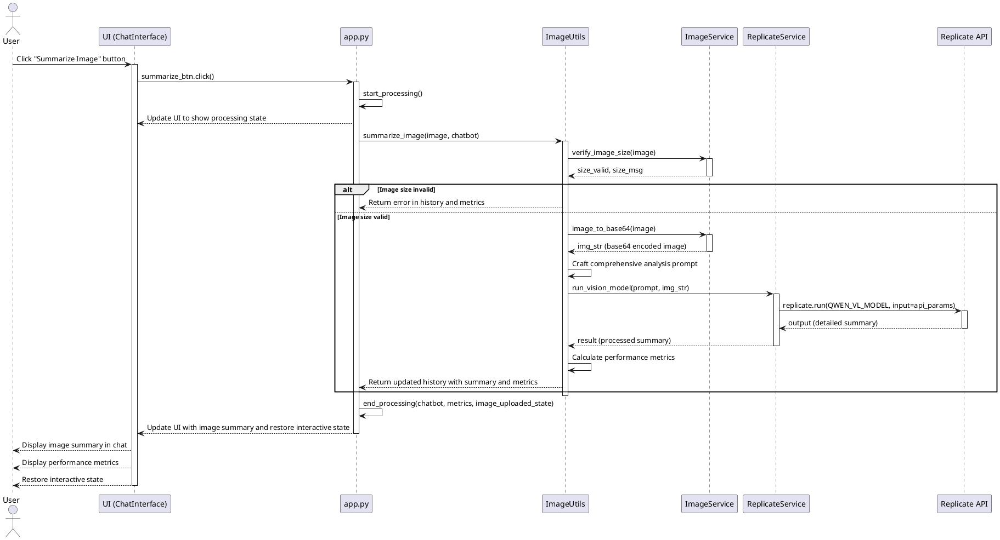

## 8. Convert Text to Speech

This sequence diagram shows the interactions when a user converts the last bot response to speech.

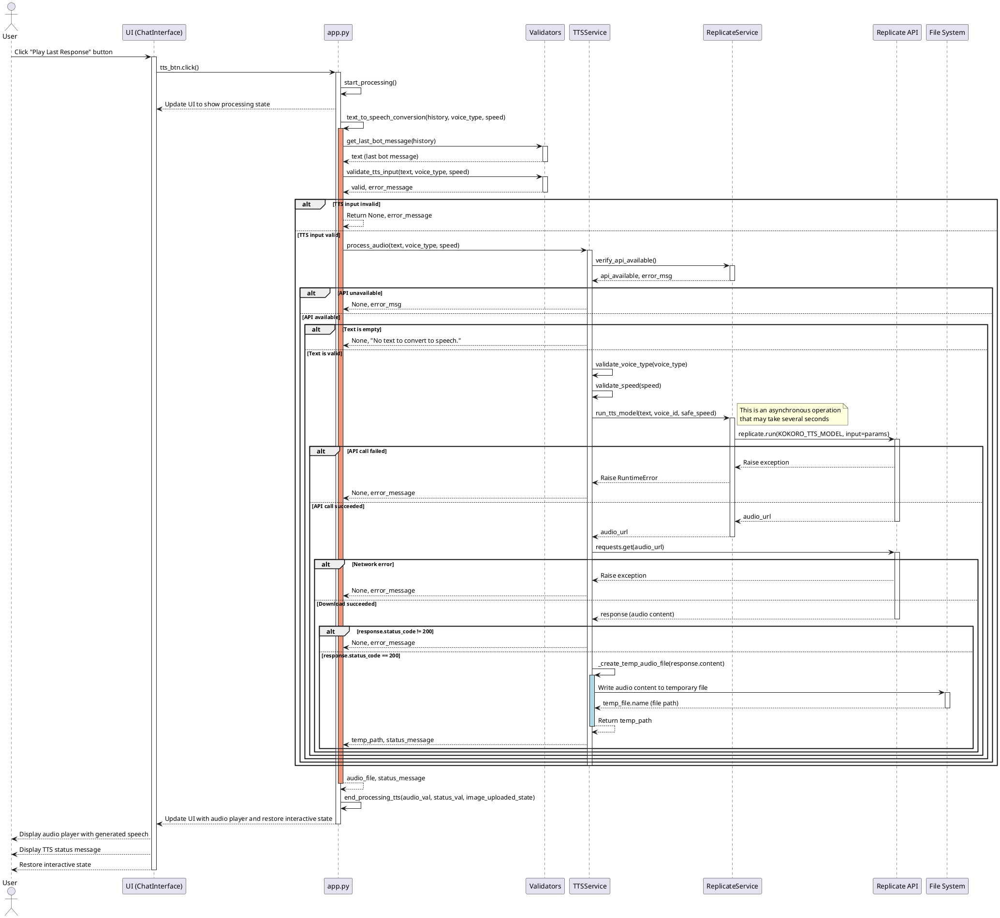

## 9. Select Voice Type

This sequence diagram shows the interactions when a user selects a voice type for text-to-speech conversion.

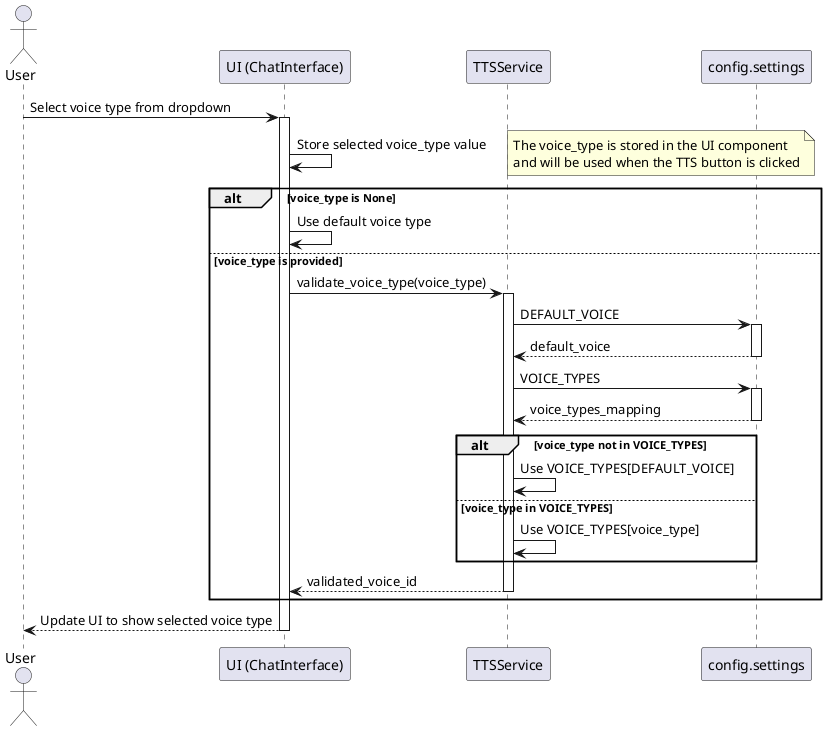

## 10. Adjust Speech Speed

This sequence diagram shows the interactions when a user adjusts the speech speed for text-to-speech conversion.

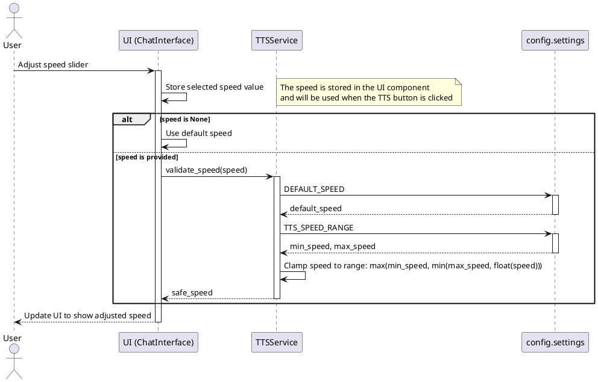

## 11. Process Image with Vision Model

This sequence diagram shows the internal interactions when processing an image with the vision model.

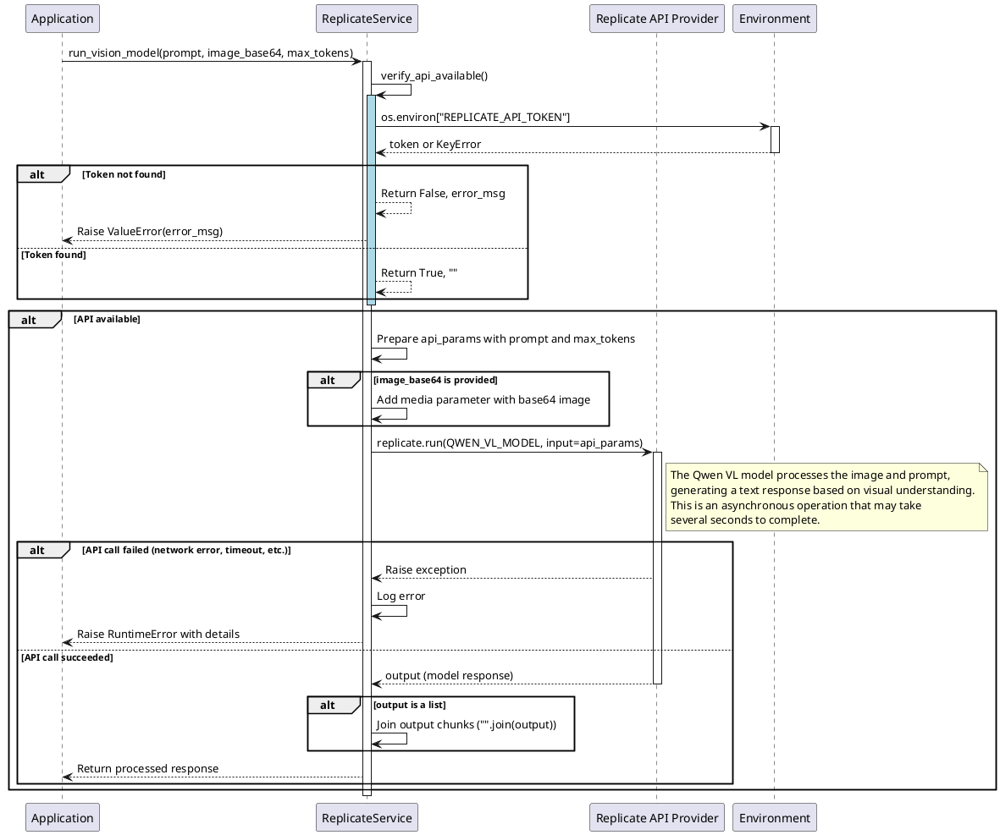

## 12. Generate Audio with TTS Model

This sequence diagram shows the internal interactions when generating audio with the TTS model.

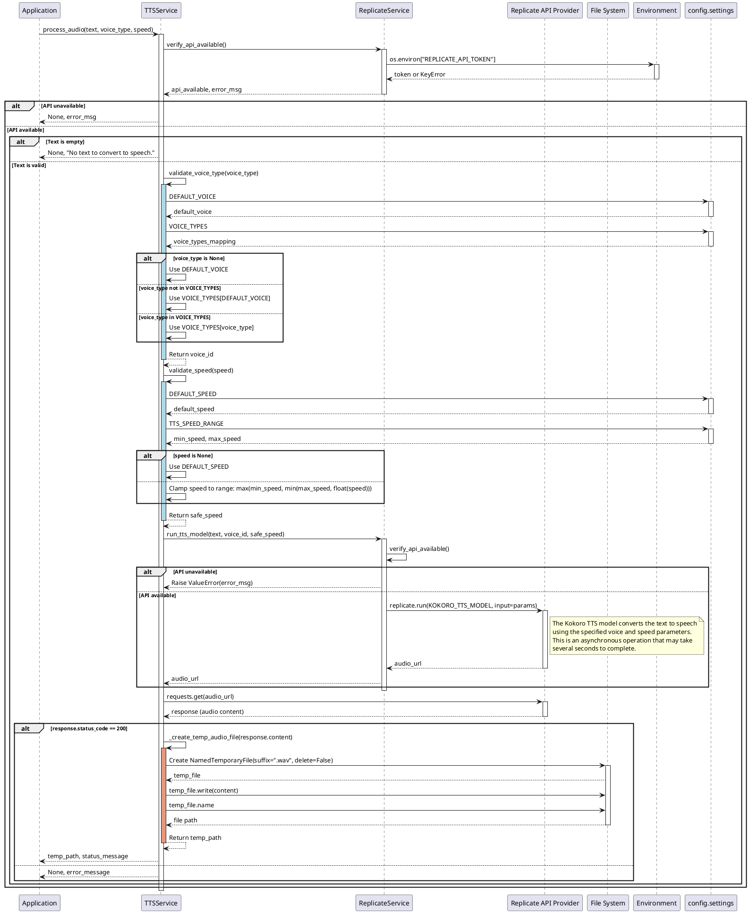

## Conclusion

These sequence diagrams illustrate the detailed interactions between components in the HearSee application for each use case. The diagrams show:

1. The flow of control between the user interface, application logic, and services
2. The precise method calls with parameters
3. Conditional logic for error handling and validation
4. The integration with external APIs (Replicate)
5. The data transformations that occur during processing