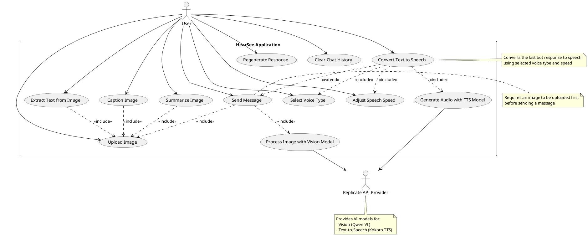

# HearSee Application - UML Use Case Diagram

## Use Case Descriptions

### Primary Use Cases

1. **Upload Image**
   - Actor: User
   - Description: User uploads an image to the application for analysis
   - Precondition: None
   - Postcondition: Image is displayed in the gallery and available for processing

2. **Send Message**
   - Actor: User
   - Description: User sends a text message related to the uploaded image
   - Precondition: Image must be uploaded
   - Postcondition: Message is processed by the vision model and a response is displayed

3. **Regenerate Response**
   - Actor: User
   - Description: User requests a new response for the last message
   - Precondition: At least one message exchange must exist
   - Postcondition: New response is generated and displayed

4. **Clear Chat History**
   - Actor: User
   - Description: User clears the entire conversation history
   - Precondition: None
   - Postcondition: Chat history is reset to initial state

### Image Processing Use Cases

5. **Extract Text from Image**
   - Actor: User
   - Description: User requests text extraction (OCR) from the uploaded image
   - Precondition: Image must be uploaded
   - Postcondition: Extracted text is displayed in the chat

6. **Caption Image**
   - Actor: User
   - Description: User requests a brief caption for the uploaded image
   - Precondition: Image must be uploaded
   - Postcondition: Image caption is displayed in the chat

7. **Summarize Image**
   - Actor: User
   - Description: User requests a detailed analysis/summary of the uploaded image
   - Precondition: Image must be uploaded
   - Postcondition: Image summary is displayed in the chat

### Text-to-Speech Use Cases

8. **Convert Text to Speech**
   - Actor: User
   - Description: User converts the last bot response to speech
   - Precondition: At least one bot response must exist
   - Postcondition: Audio is generated and available for playback

9. **Select Voice Type**
   - Actor: User
   - Description: User selects the voice type for text-to-speech conversion
   - Precondition: None
   - Postcondition: Voice type preference is stored for TTS conversion

10. **Adjust Speech Speed**
    - Actor: User
    - Description: User adjusts the playback speed for text-to-speech conversion
    - Precondition: None
    - Postcondition: Speed preference is stored for TTS conversion

### API-Related Use Cases

11. **Process Image with Vision Model**
    - Actors: User, Replicate API Provider
    - Description: System processes the image and user message with the vision model
    - Precondition: Valid image and message must be provided
    - Postcondition: AI-generated response is returned

12. **Generate Audio with TTS Model**
    - Actors: User, Replicate API Provider
    - Description: System converts text to speech using the TTS model
    - Precondition: Valid text, voice type, and speed must be provided
    - Postcondition: Audio file is generated and returned

## Subsystems

The HearSee application consists of three main subsystems:

1. **Chat Interface Subsystem**
   - Handles user interactions, message display, and UI state management
   - Includes use cases: Send Message, Regenerate Response, Clear Chat History

2. **Image Processing Subsystem**
   - Handles image upload, validation, and specialized image processing
   - Includes use cases: Upload Image, Extract Text, Caption Image, Summarize Image

3. **Text-to-Speech Subsystem**
   - Handles text-to-speech conversion and audio playback
   - Includes use cases: Convert Text to Speech, Select Voice Type, Adjust Speech Speed