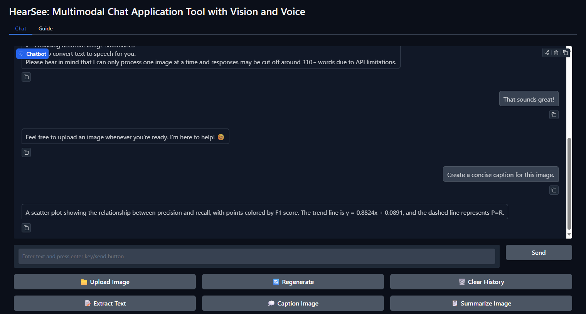
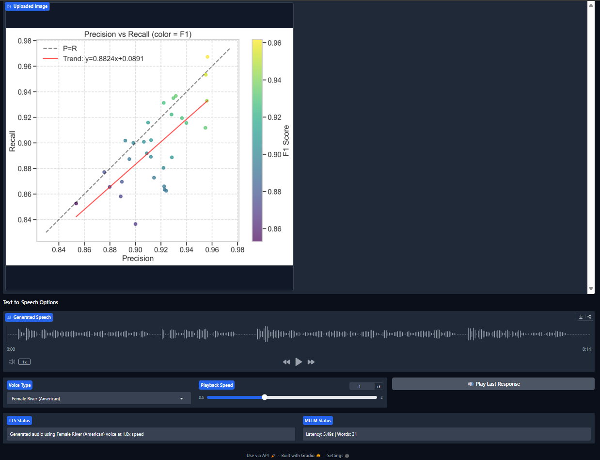

# Chapter 4: Implementation

## 4.1 Introduction

This chapter presents the implementation of the HearSee system, a chat application with vision and voice capabilities. The implementation encompasses the development environment setup, system architecture realization, component development, and user interface implementation. The chapter is structured to provide an overview of how the design was translated into a system that combines image understanding and text-to-speech capabilities in a web interface.

## 4.2 Development Environment and Hardware Specifications

### 4.2.1 Hardware Infrastructure

The system was implemented and tested on a Lenovo Legion 5i laptop using Microsoft Edge browser for testing. The development machine utilized an Intel Core i7-14650HX processor with 16 cores, 24 logical threads, 2.2GHz base clock, and 5.2GHz boost capability. The system was equipped with 32GB of DDR5-5600 RAM and a 1TB NVMe Gen 4 SSD for storage. Graphics processing was handled by an NVIDIA GeForce RTX 4060 with 8GB VRAM. The development environment ran on Windows 11 Pro (64-bit) 24H2 Release Preview operating system.

Hardware requirements for deployment and testing included webcam or camera for image capture, audio output devices for text-to-speech playback functionality, and a system specification of 8GB RAM with a 4-core CPU to ensure operation. A network connection was essential for API communication with Replicate services, as the system relies on Generative AI models for image analysis and speech synthesis.

### 4.2.2 Software Dependencies

The implementation relies on a software stack centered around Python 3.10 as the programming language. The Gradio 4.0+ framework was selected for creating the web interface due to its simplicity and support for machine learning applications. Libraries were utilized throughout the implementation. The replicate 0.18.0 library provided the API client for interacting with AI models. Image processing capabilities were implemented using Pillow 10.0.0, while python-dotenv 1.0.0 handled environment variable management for configuration. HTTP communication was managed through the requests 2.31.0 library, and operations were performed using numpy 1.24.3. The Python logging library was used for application logging.

Development tools included Visual Studio Code with Python extensions for code editing and debugging, Git for version control and development, and pytest for implementing the testing framework. These tools provided a development environment that supported implementation and testing of the HearSee system.

## 4.3 System Architecture Implementation

### 4.3.1 Overall Architecture

The HearSee system follows a three-tier architecture pattern with separation between the front-end interface, back-end processing logic, and data management components. The implementation is structured into five modules that work together to provide the functionality of the system. The Main Application (app.py) serves as the entry point that initializes the Gradio interface and connects all components. The Services module contains functionality for image processing, API integration, and text-to-speech conversion. UI Components module provides interface elements for chat, documentation, and UI elements. The Utilities module contains functions for image operations, validation, and logging. The Configuration module manages settings, constants, and logging configuration.

This approach allows for development and testing of components, making the system maintainable and extensible. The architecture follows the principle of separation of concerns, with each module having a responsibility. The import structure from app.py shows this organization:

```python
# Modular import structure from app.py
from config.settings import INIT_HISTORY
from config.logging_config import configure_logging
from services.image_service import ImageService
from services.replicate_service import ReplicateService
from services.tts_service import TTSService
from utils.validators import get_last_bot_message, validate_image_input
from utils.image_utils import ImageUtils
from ui import ChatInterface, GuideInterface, UIStateManager
```

### 4.3.2 Component Integration

The components in HearSee are integrated through a combination of dependency injection and event-driven programming. The main application (app.py) serves as the orchestrator that initializes all components and connects them through event handlers. The integration follows principles that ensure the system functions. Service Abstraction ensures that functionality is encapsulated in service classes with interfaces. The Event-Driven UI approach means user interactions trigger events that are handled by functions. State Management is implemented through Gradio's state components to maintain application state across interactions. Error Handling at service boundaries ensures the system remains when encountering conditions.

The chat message processing flow exemplifies how components are integrated in the system. When a user submits a message with an image, the UI triggers the `process_chat_message` function. This function validates inputs using utility functions, then calls the ImageService to process the image. The image is sent to the ReplicateService for AI analysis, after which the response is formatted and returned to the UI. The TTSService converts the response to speech if requested by the user. This integration approach ensures coupling between components while maintaining a flow of data and control throughout the system.

## 4.4 Application Setup and Deployment

### 4.4.1 Local Development Setup

The application utilizes Gradio for creating a web-based user interface. The setup process involves steps to prepare the development environment. The Environment Configuration begins with cloning the repository, creating and activating a virtual environment, installing dependencies from the requirements.txt file, and setting up environment variables. The .env file must be configured with the Replicate API key to enable communication with the AI models. The following commands illustrate this setup process:

```bash
# Go to the project directory
cd hearsee

# Create and activate virtual environment
python -m venv venv
source venv/bin/activate  # On Windows: venv\Scripts\activate

# Install dependencies
pip install -r requirements.txt

# Set up environment variables
cp .env.example .env
# Edit .env to add your Replicate API key
```

Application Initialization is handled through the `create_app` function in app.py, which configures the Gradio interface with theming and sets up all event handlers. This function creates a appearance while ensuring compatibility with Gradio versions through fallback mechanisms. The implementation includes version detection to handle differences in the theming API between Gradio versions:

```python
def create_app():
    """
    Create and configure the HearSee application.
    
    This function initializes the Gradio interface with custom theming,
    sets up the chat and guide tabs, and connects all event handlers
    for the interactive elements.
    
    Returns:
        gr.Blocks: Configured Gradio application ready to be launched
    """
    # Create custom theming with compatibility for different Gradio versions
    try:
        # Try to create theme with the new method (for newer Gradio versions)
        system_theme = gr.themes.Soft(
            primary_hue="blue",
            secondary_hue="blue",
            neutral_hue="gray",
            text_size=gr.themes.sizes.text_md,
            font="system-ui",
        ).set(
            # Force light mode by setting these properties
            body_background_fill="white",
            background_fill_primary="white",
            background_fill_secondary="#f7f7f7",
            block_title_text_color="black",
            block_label_text_color="black",
            input_background_fill="#ffffff",
            body_text_color="black",
        )
    except (TypeError, AttributeError):
        # Fallback for older Gradio versions
        system_theme = gr.themes.Soft(
            primary_hue="blue",
            secondary_hue="blue",
            neutral_hue="gray",
            text_size=gr.themes.sizes.text_md,
            font="system-ui",
        )
    
    # Create the main application with theme
    with gr.Blocks(theme=system_theme, title="HearSee") as hearsee:
        # Application components and event handlers are defined here
        # ...
        
    return hearsee
```

### 4.4.2 Gradio UI Implementation

The Gradio framework was selected for its simplicity in creating machine learning interfaces and its sharing capabilities. The implementation includes features that enhance the user experience and development workflow. The local application runs on http://localhost:7860 by default and provides hot-reload functionality for development along with local file system integration for data processing. The public sharing configuration offers public sharing link generation using the share=True parameter, tunnel creation through Gradio's infrastructure, and URL generation for demonstration and collaboration purposes.

The application launch configuration is implemented in the main script as shown in the following code snippet:

```python
# Example code snippet for Gradio setup from app.py
if __name__ == "__main__":
    # Create the application
    app = create_app()
    
    # Launch with optional public sharing
    app.launch(
        share=False,  # Set to True for public sharing
        server_name="0.0.0.0",
        server_port=7860
    )
```

The selection of Gradio as the UI framework was justified by factors. Its prototyping capabilities allowed for iteration on the UI design during development. The support for input/output types (text, images, audio) aligned with the nature of HearSee. Configuration was required for web deployment, which reduced development overhead. The sharing functionality eliminated the need for hosting setup, simplifying demonstration and testing. The event-driven programming model simplified the implementation of user interactions, resulting in a codebase.

## 4.5 Critical Function Implementation

### 4.5.1 Core Processing Functions

#### 4.5.1.1 Image Processing and Analysis

The image processing and analysis functionality is central to the HearSee system, enabling it to process user-uploaded images and prepare them for AI analysis. The implementation of this function is encapsulated in the process_chat_message function, which handles the functionality of processing user messages with the uploaded image. This function validates inputs, calls the vision model, and formats the response for display to the user.

```python
def process_chat_message(message, history, metrics, image=None):
    """Process a chat message and return updated history and metrics.
    
    This function handles the core functionality of processing user messages
    with the uploaded image. It validates inputs, calls the vision model,
    and formats the response.
    
    Args:
        message (str): The user's text message
        history (list): The conversation history as a list of [user, bot] message pairs
        metrics (str): Current performance metrics string
        image (numpy.ndarray, optional): The uploaded image data. Defaults to None.
    
    Returns:
        tuple: (updated_history, updated_metrics)
            - updated_history (list): Conversation history with new message pair
            - updated_metrics (str): Updated performance metrics string
    """
    start_time = time.time()
    logger.info(f"Processing chat message: {message[:50]}{'...' if len(message) > 50 else ''}")
    
    # Check image size
    size_valid, size_msg = ImageService.verify_image_size(image)
    if not size_valid:
        logger.warning(f"Image size validation failed: {size_msg}")
        return history + [[message, size_msg]], "Error: Image too large"
    
    # Check API availability
    api_available, error_msg = ReplicateService.verify_api_available()
    if not api_available:
        logger.error(f"API unavailable: {error_msg}")
        return history + [[message, error_msg]], "Error: API unavailable"
    
    # Validate image requirement
    valid_img, img_error = validate_image_input(image)
    if not valid_img:
        logger.warning(f"Image validation failed: {img_error}")
        return history + [[message, img_error]], "Error: Image required"
    
    # Process the message
    try:
        # Convert image to base64 for API transmission
        img_str = ImageService.image_to_base64(image)
        
        # Build system prompt that defines the AI assistant's role and capabilities
        system_prompt = "You are a helpful AI assistant specializing in analyzing images and providing detailed information."
        
        # Convert conversation history to a formatted context string
        # This preserves the conversation flow for the model
        context = ""
        for h in history:
            if h[0] is not None:  # Skip entries with no user message
                context += f"User: {h[0]}\nAssistant: {h[1]}\n\n"
        
        logger.debug("Running vision model")
        # Run the vision model with the complete prompt context and image
        result = ReplicateService.run_vision_model(
            f"{system_prompt}\n\nConversation History:\n{context}\nUser: {message}\nAssistant:",
            image_base64=img_str
        )
        
        # Calculate performance metrics for user feedback
        end_time = time.time()
        latency = end_time - start_time  # Total processing time in seconds
        word_count = len(result.split())  # Approximate word count of response
        updated_metrics = f"Latency: {latency:.2f}s | Words: {word_count}"
        
        logger.info(f"Chat message processed successfully in {latency:.2f}s")
        # Return updated history and metrics
        return history + [[message, result]], updated_metrics
    except Exception as e:
        logger.error(f"Error processing chat message: {str(e)}", exc_info=True)
        error_msg = f"Sorry, I encountered an error: {str(e)}"
        return history + [[message, error_msg]], "Error: System unavailable. Please try again."
```

This approach was chosen for reasons. The validation ensures that inputs meet requirements before processing, preventing errors and improving system reliability. Context preservation through including conversation history provides the AI model with context for responses, enhancing the user experience. Performance metrics tracking for latency and word count provides transparency to users about system performance, setting expectations. The error handling with user feedback maintains a user experience even when issues occur, preventing frustration and confusion.

Implementation decisions shaped this function. Using base64 encoding for image transmission to the API ensures compatibility and reduces issues with file handling across environments. Formatting the prompt with system instructions, conversation history, and user message provides guidance to the AI model, resulting in responses. Logging at levels facilitates debugging and monitoring in production, making the system easier to maintain and troubleshoot.

#### 4.5.1.2 Text-to-Speech Conversion

The text-to-speech conversion functionality enables the system to convert AI-generated text responses to speech, enhancing accessibility and user experience. The implementation is encapsulated in the text_to_speech_conversion function, which extracts the last bot message from the conversation history and converts it to speech using the voice type and speed parameters.

```python
def text_to_speech_conversion(history, voice_type, speed):
    """Convert last bot message to speech.
    
    This function extracts the last bot message from the conversation history
    and converts it to speech using the specified voice type and speed.
    
    Args:
        history (list): The conversation history as a list of [user, bot] message pairs
        voice_type (str): The type of voice to use for TTS
        speed (float): The speed factor for speech playback
    
    Returns:
        tuple: (audio_file, status_message)
            - audio_file (str or None): Path to the generated audio file or None if failed
            - status_message (str): Status message indicating success or failure
    """
    text = get_last_bot_message(history)
    logger.info(f"Converting text to speech with voice: {voice_type}, speed: {speed}")
    result = TTSService.process_audio(text, voice_type, speed)
    if result[0] is None:
        logger.warning(f"TTS conversion failed: {result[1]}")
    else:
        logger.info("TTS conversion successful")
    return result
```

The TTS implementation follows design principles. Modularity is achieved by delegating the TTS processing to the TTSService, maintaining separation of concerns and making the code maintainable. The interface is designed for simplicity, requiring only the conversation history and TTS parameters, which makes it easy to use and understand. Status messages inform the user about the success or failure of the operation, enhancing the user experience. Logging helps with debugging and monitoring, making the system easier to maintain.

Implementation decisions for the TTS functionality include using files for audio storage, which avoids the need for storage while allowing playback. The system supports voice types and speed adjustments, enhancing user experience and accessibility for needs and preferences. Delegating to the TTSService allows for changes in the TTS backend without affecting the UI, making the system adaptable to requirements.

### 4.5.2 Error Handling and Validation

The implementation incorporates error handling at levels to ensure system reliability and a user experience. The TTSService's process_audio function exemplifies this approach:

```python
# Example of robust error handling in the TTSService
def process_audio(text, voice_type=None, speed=None):
    """Process text to speech conversion."""
    # Check API availability
    api_available, error_msg = ReplicateService.verify_api_available()
    if not api_available:
        return None, error_msg

    # Validate inputs
    if not text or text.strip() == "":
        return None, "No text to convert to speech."

    try:
        # Get validated parameters
        voice_id = TTSService.validate_voice_type(voice_type)
        safe_speed = TTSService.validate_speed(speed)

        # Get audio URL from Replicate
        audio_url = ReplicateService.run_tts_model(text, voice_id, safe_speed)

        # Download and save audio
        response = requests.get(audio_url)
        if response.status_code == 200:
            # Create temporary file with the audio content
            temp_path = TTSService._create_temp_audio_file(response.content)
            return temp_path, f"Generated audio using {voice_type or DEFAULT_VOICE} voice at {safe_speed}x speed"
        else:
            return None, f"Error downloading audio: HTTP status {response.status_code}"

    except Exception as e:
        # Include "Error downloading audio" in the message if it's a connection error
        if "ConnectionError" in str(type(e)) or "Network error" in str(e):
            return None, f"Error downloading audio: {str(e)}"
        return None, f"Error generating speech: {str(e)}"
```

The error handling strategy includes components. Input validation ensures all user inputs are validated before processing, preventing errors from data. Parameter sanitization ensures parameters are sanitized to meet requirements, maintaining system integrity. Exception handling through try-except blocks catches and handles exceptions at levels, preventing crashes. User feedback is provided through error messages formatted for user consumption, enhancing the user experience. Logging of errors with context supports debugging and system improvement.

This approach ensures that the system degrades when errors occur, maintaining a user experience even in the face of conditions or inputs.
## 4.6 Front-end Implementation

### 4.6.1 User Interface Design

The front-end implementation focuses on creating a user experience that makes the system accessible to users with levels of expertise. The interface components include a chat display for conversation history, text input field for user messages, image upload button and gallery for content, action buttons for functions (extract text, caption, summarize), text-to-speech controls with voice selection and speed adjustment, and status indicators for system performance and operation feedback.

The UI was implemented using Gradio components, organized into sections with visual hierarchy. The ChatInterface class encapsulates the UI creation logic, as shown in the following implementation:

```python
@staticmethod
def create_interface():
    """
    Create the complete chat interface with all components and event handlers.
    
    This method constructs the entire UI layout using Gradio components,
    organizing them into a logical structure with appropriate styling and
    configuration.
    """
    with gr.Column():
        # Main chat display and initial instruction message
        chatbot = create_chatbot_component()  # Main chat history display
        image_instruction = create_image_instruction()  # Warning to upload image first

        # User input section with text field and send button
        with gr.Row():
            msg = gr.Textbox(
                label="Text Input",
                placeholder="Enter text and press enter key/send button",
                scale=9,
                container=True,
                show_label=False,
            )
            send_btn = gr.Button("Send", interactive=False)  # Initially disabled until image upload

        # Primary action buttons for image handling and chat management
        with gr.Row():
            upload_btn = gr.UploadButton("📁 Upload Image", file_types=["image"], file_count="single")
            regenerate_btn = gr.Button("🔄 Regenerate")
            clear_btn = gr.Button("🗑️ Clear History")

        # Specialized image processing action buttons
        with gr.Row():
            extract_btn = gr.Button("📝 Extract Text", interactive=False)  # OCR functionality
            caption_btn = gr.Button("💭 Caption Image", interactive=False)  # Image description
            summarize_btn = gr.Button("📋 Summarize Image", interactive=False)  # Detailed analysis

        # Image display gallery
        with gr.Row():
            gallery = gr.Gallery(
                label="Uploaded Image",
                show_label=True,
                columns=2,  # Support for before/after comparisons
                rows=1,
                object_fit="scale-down",  # Maintains aspect ratio
            )

        # Text-to-Speech section header
        gr.Markdown("### Text-to-Speech Options")

        # Audio playback component for TTS output
        with gr.Row():
            audio_output = gr.Audio(label="Generated Speech", interactive=False)

        # TTS configuration controls
        with gr.Row():
            voice_type = create_voice_type_dropdown()  # Voice selection
            speed = create_speed_slider()  # Playback speed adjustment
            tts_btn = gr.Button("🔊 Play Last Response")  # Trigger TTS generation

        # System status indicators
        with gr.Row():
            tts_status = gr.Textbox(
                label="TTS Status",
                interactive=False,
                value="Idle",  # Default state
                scale=1  # Add scale parameter for responsive sizing
            )
            performance_metrics = create_mllm_status()  # Multimodal LLM performance tracking
```

### 4.6.2 User Experience Considerations

The user experience design was guided by principles to ensure the application is accessible and easy to use. Navigation is achieved through labeling and grouping of controls, making the interface easy to understand and navigate. Feedback through processing indicators and status messages keeps users informed about system state and operations, reducing uncertainty. Error message clarity is ensured through error messages with guidance, helping users recover from errors. Progressive disclosure presents features in a way that doesn't overwhelm users, making the system approachable.

Accessibility features were incorporated throughout the design to ensure the application is usable by people with abilities. Text-to-speech functionality provides audio access to AI responses, making the application accessible to users with impairments. UI elements with sizing enhance readability for all users. Keyboard navigation support for all interactive elements ensures the application can be used without a mouse. Labels and alt text for UI components improve screen reader compatibility, enhancing accessibility.

### 4.6.3 Interface Screenshots

The main chat interface, shown in Figure 4.1, displays the conversation history at the top, with user messages on the right and AI responses on the left. Below the chat area are the text input field and action buttons for image upload, regeneration, and clearing history. The image processing buttons (Extract Text, Caption Image, Summarize Image) are arranged horizontally for access. The image gallery displays the uploaded image, and the text-to-speech controls are at the bottom of the interface.



Figure 4.2 shows the interface after an image has been uploaded. The image is displayed in the gallery, and all image-related action buttons are now enabled. The text-to-speech section at the bottom shows the voice selection dropdown, speed slider, and play button. The status indicators at the bottom right show the TTS status and performance metrics.


## 4.7 Back-end Implementation

### 4.7.1 Server Architecture

The back-end implementation handles responsibilities that are essential to the system's functionality. Data processing and computation are managed through service modules that encapsulate functionality. File management and storage for images and audio ensure resource usage. API communication with Replicate enables AI model inference for image analysis and text-to-speech. Session management and state handling for the UI maintain a user experience across interactions.

The server architecture is built around the concept of services that are instantiated as needed, with state maintained in the Gradio interface. This approach simplifies the implementation and avoids the need for state management, making the system maintainable and easier to reason about.

### 4.7.2 Data Processing Pipeline

The implementation includes a data processing pipeline that handles the flow of data from user input to AI processing and back to the user interface. The ReplicateService's run_vision_model method exemplifies this pipeline:

```python
# Example of the data processing pipeline in the ReplicateService
@staticmethod
def run_vision_model(prompt, image_base64=None, max_tokens=DEFAULT_MAX_TOKENS):
    """
    Run the Qwen VL model with given prompt and optional image.
    
    Args:
        prompt (str): The text prompt for the model.
        image_base64 (str, optional): Base64 encoded image. Defaults to None.
        max_tokens (int, optional): Maximum number of tokens to generate. Defaults to DEFAULT_MAX_TOKENS.
    
    Returns:
        str: Model's text response.
    """
    # Validate API availability before running
    api_available, error_msg = ReplicateService.verify_api_available()
    if not api_available:
        logger.error(f"API not available: {error_msg}")
        raise ValueError(error_msg)

    # Prepare API parameters
    api_params = {
        "prompt": prompt,
        "max_new_tokens": max_tokens,
    }
    
    # Add image if provided
    if image_base64:
        api_params["media"] = f"data:image/png;base64,{image_base64}"
        logger.info("Image included in vision model request")
    else:
        logger.info("Running vision model without image")

    # Run the model
    try:
        logger.debug(f"Calling Replicate API with model: {QWEN_VL_MODEL}")
        output = replicate.run(QWEN_VL_MODEL, input=api_params)
        logger.info("Vision model API call completed successfully")
        
        # Replicate may return output as a list of string chunks or a single string
        # We join the chunks if it's a list, otherwise return as is
        return "".join(output) if isinstance(output, list) else output
    except Exception as e:
        logger.error(f"Error running vision model: {str(e)}", exc_info=True)
        raise RuntimeError(f"Error running vision model: {str(e)}")
```

Implementation justifications guided the development of the back-end components. The service-based architecture encapsulates functionality in service classes, improving maintainability and testability by providing boundaries and responsibilities. The design of services makes them easier to reason about and test, as they don't maintain state between calls. Logging at levels provides visibility into the system's operation, facilitating debugging and monitoring. Error propagation up the call stack with context enables handling at the UI level, providing a user experience.

### 4.7.3 Integration Points

The front-end and back-end components integrate through a event handling system in the main application (app.py). The integration points include event handlers that respond to UI events and call back-end services, state management through Gradio state components that maintain application state across interactions, data transformation functions that convert data between UI and service formats, and error handling patterns that provide feedback to users.

The event chain for sending a message demonstrates how these integration points work together:

```python
# Event chain for message submission via Enter key
send_handler = msg.submit(
    # Step 1: Show processing state and disable all interactive elements
    start_processing,
    inputs=None,  # No inputs needed
    outputs=[processing_indicator, msg, send_btn, upload_btn, extract_btn,
             caption_btn, summarize_btn, regenerate_btn, tts_btn, processing_status]
).then(
    # Step 2: Process the message with the AI model
    locked_chat_response,
    inputs=[msg, chatbot, performance_metrics, image_output],  # Message and context
    outputs=[chatbot, performance_metrics, msg],  # Updated conversation and metrics
    show_progress="full"  # Show progress bar during processing
).then(
    # Step 3: Restore UI state after processing completes
    end_processing,
    inputs=[chatbot, performance_metrics, image_uploaded_state],  # Current state
    outputs=[chatbot, performance_metrics, processing_indicator, msg, send_btn,
             upload_btn, extract_btn, caption_btn, summarize_btn,
             regenerate_btn, tts_btn, processing_status]  # UI elements to update
)
```

This event chain demonstrates how the UI and back-end components work together to provide a user experience, with state transitions and feedback throughout the process.
## 4.8 Configuration and Customization

### 4.8.1 Configuration Management

The system implements configuration management through the settings.py module, which centralizes all constant values and configuration parameters. This approach provides a source of truth for system settings and makes the application maintainable and configurable:

```python
# Configuration structure example from settings.py
# Replicate Model Constants - specific model versions for reproducibility
QWEN_VL_MODEL = "lucataco/qwen2-vl-7b-instruct:bf57361c75677fc33d480d0c5f02926e621b2caa2000347cb74aeae9d2ca07ee"
KOKORO_TTS_MODEL = "jaaari/kokoro-82m:f559560eb822dc509045f3921a1921234918b91739db4bf3daab2169b71c7a13"

# API Configuration - controls response length
DEFAULT_MAX_TOKENS = 512  # Balances between detailed responses and API costs

# Image Processing Settings - prevents uploading excessively large images
MAX_IMAGE_SIZE = 10 * 1024 * 1024  # 10MB in bytes (10 * 1024KB * 1024B)

# TTS Configuration - voice options for text-to-speech conversion
VOICE_TYPES = {
    "Female River (American)": "af_river",
    "Female Bella (American)": "af_bella",
    "Female Emma (British)": "bf_emma",
    "Male Michael (American)": "am_michael",
    "Male Fenrir (American)": "am_fenrir",
    "Male George (British)": "bm_george"
}

# Valid range for speech speed adjustment - prevents unintelligible output
TTS_SPEED_RANGE = (0.5, 2.0)  # (min_speed, max_speed)

# Default TTS Settings - used when user doesn't specify preferences
DEFAULT_VOICE = "Female River (American)"  # Must match a key in VOICE_TYPES
DEFAULT_SPEED = 1.0  # Normal speaking rate (1.0x)
```

This configuration approach offers advantages. All constants are defined in one place, providing a source of truth that prevents inconsistencies. Each setting is documented with comments explaining its purpose, making the configuration self-documenting. Settings can be changed without modifying code, simplifying configuration updates. All modules access settings through the same interface, ensuring usage throughout the application.

### 4.8.2 Customization Options

The implementation provides customization options that allow the system to be adapted to use cases and requirements. Model selection can be updated through the Replicate model identifiers to use AI models as they become available. Voice options can be extended or modified to support voices, enhancing the text-to-speech experience. UI theming can be customized to match branding requirements, providing a visual identity. Response length can be adjusted through the maximum token limit to balance detail and cost based on needs. Image size limits can be modified based on system capabilities and performance requirements.

These customization options allow the system to be adapted to use cases and requirements without code changes, enhancing its flexibility and longevity.

## 4.9 Security Considerations

### 4.9.1 Input Validation

All user inputs undergo validation to ensure system security and stability. The image validation function exemplifies this approach:

```python
def validate_image_input(image):
    """
    Validate that an image is provided and in the correct format.
    
    Args:
        image: The image to validate
        
    Returns:
        tuple: (is_valid, error_message)
    """
    if image is None:
        return False, "Please upload an image first. The system requires an image to analyze."
    
    try:
        # Additional validation could be added here
        # For example, checking image dimensions, content type, etc.
        return True, ""
    except Exception as e:
        return False, f"Invalid image format: {str(e)}"
```

The validation strategy includes components. Existence checks ensure that required inputs are provided, preventing null reference errors. Type checks verify that inputs are of the expected type, ensuring compatibility with processing functions. Range checks ensure numerical values are within ranges, preventing performance issues and behavior. Format validation verifies that inputs meet format requirements, ensuring compatibility with downstream processing. Size limits are enforced on uploads to prevent resource exhaustion, protecting system stability.

### 4.9.2 Data Protection

The implementation includes data protection measures to ensure user privacy and system security. API key protection is implemented by storing the Replicate API key in environment variables rather than in code, preventing exposure in version control systems. Storage is used for images and audio files, which are cleaned up after use to minimize data retention. The system implements no storage of user data, enhancing privacy by ensuring that user interactions are not retained after the session ends. Communication is ensured through HTTPS for data protection in transit when communicating with external APIs. Input sanitization is applied to all inputs before use to prevent injection attacks and security vulnerabilities.

These measures ensure that user data is protected throughout the application lifecycle, maintaining privacy and security while providing the functionality of the system.

## 4.10 Implementation Challenges and Solutions

### 4.10.1 Technical Challenges

The implementation of the HearSee system encountered challenges that required solutions. One challenge was handling large image files. The solution involved implementing size validation and limits to prevent resource exhaustion. Images are validated before processing, and users are provided with feedback when images exceed size limits. This approach improved system stability and prevented crashes due to memory exhaustion, ensuring a user experience.

Another challenge was managing API rate limits and costs associated with the Replicate service. The solution implemented token limits and prompt construction to minimize API usage. The system also provides performance metrics to users, making them aware of resource usage. This approach reduced API costs while maintaining response quality and improved user awareness of system performance, creating a transparent and system.

Creating a UI that handles asynchronous operations presented another challenge. The solution involved implementing a state-based UI with visual feedback during processing. The UI disables interactive elements during processing and provides progress indicators to keep users informed. This enhanced the user experience by providing feedback about system state and preventing operations that could lead to conflicts or errors.

Ensuring compatibility across Gradio versions was also challenging. The solution implemented version detection and fallback mechanisms for theme creation and component configuration. This improved compatibility across environments and simplified deployment, making the system robust and adaptable to environments.

### 4.10.2 Design Trade-offs

Trade-offs were made during implementation to balance requirements and constraints. The choice between a web interface and a native application was resolved in favor of a web interface with Gradio. This provided development and cross-platform compatibility at the cost of performance and offline capabilities. The trade-off was justified by the need for deployment and sharing, which aligned with the project's goals.

Another trade-off involved choosing between cloud API and local models for AI processing. Using Replicate's API for AI models instead of running models locally reduced system requirements and simplified deployment, but introduced API dependency and costs. The benefits of accessing models without hardware requirements outweighed these drawbacks, making this a trade-off.

The decision between temporary and persistent storage was another consideration. Using temporary storage for images and audio files enhanced privacy and reduced storage requirements, but limited the ability to save and retrieve past interactions. This aligned with the project's focus on privacy and simplicity, making it a trade-off for the system's goals.

Finally, the team chose to focus on versus focused features. Limiting the application to core image analysis and TTS features allowed for a implementation of these features, rather than a broader but less feature set. This trade-off ensured that the implemented features worked well and provided a user experience, rather than attempting to implement too many features with lower quality.

## 4.11 Summary

This chapter has presented the implementation of the HearSee system. The implementation translates the design into a system using Python, Gradio, and Replicate API integration. Key achievements include a architecture with separation of concerns, which enhances maintainability and extensibility. The user interface for image analysis and text-to-speech provides an accessible and experience. Error handling and validation improve reliability, ensuring the system degrades when issues occur. Integration with AI models through the Replicate API enables image analysis and speech synthesis capabilities. Logging and performance metrics enhance transparency and facilitate debugging.

The implementation provides a foundation for the testing and evaluation discussed in the following chapter. The architecture and error handling ensure system reliability and maintainability, while the design principles enhance usability and accessibility. These characteristics make the HearSee system a tool for interaction combining vision and voice capabilities.